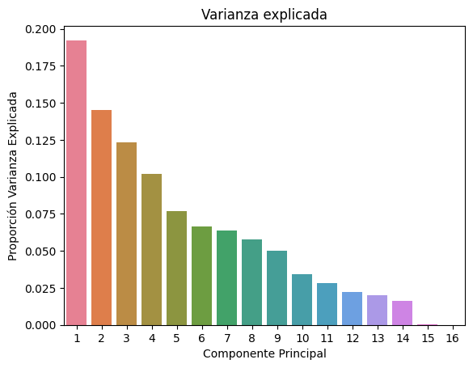

# **Ciencia de datos para Economía - Examen**

## *Analisis descriptivo y visualización de datos*

El dataset **ingresos.txt** contiene 1.816 filas y 14 columnas.
A continuación se describen las columnas:

- estatura: Unidad de medida centímetros
- peso: Unidad de medida kilogramos
- genero
- ingresos: en dólares
- etnia: etnia en EE.UU.
- educacion: en años
- educacion_madre: en años
- educacion_padre: en años
- Camina: Camina al trabajo
  1. Nunca
  2. Una vez al mes o menos
  3. Alrededor de dos veces al mes
  4. Alrededor de una veces a la semana
  5. Dos veces a la semana
  6. Tres veces a la semana
  7. Mas de tres veces a la semana
  8. Todos los días
- ejercicio: días de la semana que practica ejercicios
fumador: Fuma 7 cigarros o más a la semana
  1. Si
  2. No
- tenso: días de la semana en dicho estado
- malhumorado: : días de la semana en dicho estado
- edad: en años

### Visualizacion de los primeros 3 datos del dataset

```bash
  data.head(3)
```

|   estatura |   peso | genero    |   ingresos | etnia   |   educacion |   educacion_madre |   educacion_padre |   camina |   ejercicio |   fumador |   tenso |   malhumorado |   edad |
|-----------:|-------:|:----------|-----------:|:--------|------------:|------------------:|------------------:|---------:|------------:|----------:|--------:|--------------:|-------:|
|     187.96 |  95.25 | masculino |      50000 | Blanco  |          16 |                16 |                16 |        3 |           3 |         2 |       0 |             0 |     45 |
|     167.64 |  56.7  | femenino  |      60000 | Blanco  |          16 |                16 |                16 |        6 |           5 |         1 |       0 |             0 |     58 |
|     162.56 |  57.15 | femenino  |      30000 | Blanco  |          16 |                16 |                16 |        8 |           1 |         2 |       1 |             1 |     29 |

### Descripcion de los datos:

A partir de la siguiente tabla descriptiva:

```bash
  data.describe().T
```

|                 |   count |        mean |          std |    min |     25% |      50% |       75% |       max |
|:----------------|--------:|------------:|-------------:|-------:|--------:|---------:|----------:|----------:|
| estatura        |    1816 |   169.085   |     9.73283  | 144.78 |  162.56 |   167.64 |   175.895 |    208.28 |
| peso            |    1789 |    70.8984  |    15.7019   |  36.29 |   58.97 |    68.04 |    81.65  |    155.13 |
| ingresos        |    1816 | 21147.3     | 22531.8      |   0    | 6000    | 16000    | 27000     | 400000    |
| educacion       |    1814 |    13.2354  |     2.55664  |   2    |   12    |    12    |    15     |     18    |
| educacion_madre |    1572 |    13.6088  |     3.21937  |   3    |   12    |    13    |    16     |     99    |
| educacion_padre |    1521 |    13.6522  |     3.25081  |   3    |   12    |    13    |    16     |     99    |
| camina          |    1816 |     5.30341 |     2.6011   |   1    |    3    |     6    |     8     |      8    |
| ejercicio       |    1816 |     3.04901 |     2.31639  |   1    |    1    |     2    |     5     |      7    |
| fumador         |    1815 |     1.74545 |     0.435725 |   1    |    1    |     2    |     2     |      2    |
| tenso           |    1815 |     1.42149 |     2.15785  |   0    |    0    |     0    |     2     |      7    |
| malhumorado     |    1815 |     1.42149 |     2.15785  |   0    |    0    |     0    |     2     |      7    |
| edad            |    1816 |    42.9345  |    17.1617   |  18    |   29    |    39    |    56     |     91    |

Se llegan a las siguientes conclusiones
- Estatura promedio: 169.1 cm, con una desviación estándar de 9.7 cm.
- Peso promedio: 70.9 kg, desviación estándar de 15.7 kg.
- Ingresos promedio: 21,147.3 unidades, con una desviación estándar de 22,531.8.
- Educación: Promedio de 13.2 años de educación.
- Actividad física: Promedio de 5.3 en caminar y 3.1 en ejercicio.
- Fumadores: Mayoría no fumadores.
- Edad promedio: 42.9 años.

Nada particularmente llamativo, por lo tanto continua el analisis.

### Visualizacion tipo de datos por columna:

```bash
  print(data.dtypes)
```

|                 | 0       |
|:----------------|:--------|
| estatura        | float64 |
| peso            | float64 |
| genero          | object  |
| ingresos        | float64 |
| etnia           | object  |
| educacion       | float64 |
| educacion_madre | float64 |
| educacion_padre | float64 |
| camina          | int64   |
| ejercicio       | int64   |
| fumador         | float64 |
| tenso           | float64 |
| malhumorado     | float64 |
| edad            | int64   |

Los tipos de datos también están leídos correctamente.

### Datos nulos (conteo de valores faltantes):

```bash
  nan = data.isna().sum()
print(nan)
```

|                 |   0 |
|:----------------|----:|
| estatura        |   0 |
| peso            |  27 |
| genero          |   0 |
| ingresos        |   0 |
| etnia           |   0 |
| educacion       |   2 |
| educacion_madre | 244 |
| educacion_padre | 295 |
| camina          |   0 |
| ejercicio       |   0 |
| fumador         |   1 |
| tenso           |   1 |
| malhumorado     |   1 |
| edad            |   0 |

Como se puede observar en la tabla, los datos nulos corresponden a un porcentaje no menor del total de datos del dataset.
El mayor porcentaje de valores nulos se concentra entonces entre las variables **peso,** **educacion_madre** y **educacion_padre** y en consecuencia la eliminación de los datos nulos, en este caso, se descarta. Se procede entonces a la imputacion.

## *Imputacion de datos usando KNN*

Se transformaron primeramente las variables categoricas **genero** y **etnia** a dummies.

```bash
col_for_dummies = data.select_dtypes(object).columns
data = pd.get_dummies(data, col_for_dummies, dtype=int, drop_first=True)
```

Posteriormente, se realizó la imputacion de los datos nulos usando KNN. Luego de múltiples intentos, se llegó a la conclusión de que el valor óptimo de vecinos para el modelo KNN es de 5.

```bash
original_data.head()
```

| estatura | peso  | ingresos | educacion | educacion_madre | educacion_padre | camina | ejercicio | fumador | tenso | malhumorado | edad | genero_masculino | etnia_Blanco | etnia_Latino | etnia_Other |
|----------|-------|----------|-----------|-----------------|-----------------|--------|-----------|---------|-------|-------------|------|------------------|--------------|--------------|-------------|
| 187.96   | 95.25 | 50000.0  | 16        | 16              | 16              | 3      | 3         | 2       | 0     | 0           | 45   | 1                | 1            | 0            | 0           |
| 167.64   | 56.70 | 60000.0  | 16        | 16              | 16              | 6      | 5         | 1       | 0     | 0           | 58   | 0                | 1            | 0            | 0           |
| 162.56   | 57.15 | 30000.0  | 16        | 16              | 16              | 8      | 1         | 2       | 1     | 1           | 29   | 0                | 1            | 0            | 0           |
| 165.10   | 90.72 | 25000.0  | 17        | 17              | 16              | 8      | 1         | 2       | 0     | 0           | 57   | 0                | 1            | 0            | 0           |
| 160.02   | 49.90 | 50000.0  | 16        | 16              | 16              | 5      | 6         | 2       | 0     | 0           | 91   | 0                | 0            | 0            | 1           |

Valores nulos posterior a la imputación por KNN

```bash
nan2 = original_data.isna().sum()
print(nan2)
```

| Variable           | Valor |
|--------------------|-------|
| estatura           | 0     |
| peso               | 0     |
| ingresos           | 0     |
| educacion          | 0     |
| educacion_madre    | 0     |
| educacion_padre    | 0     |
| camina             | 0     |
| ejercicio          | 0     |
| fumador            | 0     |
| tenso              | 0     |
| malhumorado        | 0     |
| edad               | 0     |
| genero_masculino   | 0     |
| etnia_Blanco       | 0     |
| etnia_Latino       | 0     |
| etnia_Other        | 0     |

## Regresión Lasso para la seleccion de variables

### Resultados del Entrenamiento y Prueba

- **Entrenamiento**  
  - MSE: 420498506.06712383  
  - R²: 0.16095756408982054

- **Prueba**  
  - MSE: 408924310.85877055  
  - R²: 0.2385311145200868

### Resumen del Modelo

| Modelo           | MSE            | R²       |
|------------------|----------------|----------|
| Regresión Lasso  | 4.089243e+08   | 0.238531 |

**El mejor valor de alpha es**: 10  
**Mejor penalización**: Lasso(alpha=10)

### Coeficientes del Modelo Lasso

| variables        | coeficientes   |
|------------------|----------------|
| estatura         | 552.599663     |
| peso             | 5.721357       |
| educacion        | 2190.492669    |
| educacion_madre  | -350.522581    |
| educacion_padre  | 663.244331     |
| camina           | -46.667750     |
| ejercicio        | 627.158541     |
| fumador          | -1129.360585   |
| tenso            | -17.626880     |
| malhumorado      | -0.000000      |
| edad             | 222.014352     |

Se observa que el coeficiente de la variable **malhumorado** es cero, por lo tanto, no aporta al modelo.

## *Modelos*

Se realizaron 5 modelos:

```bash
X = original_data[col_incluir].copy()
y = original_data['ingresos']
```

| Modelo                     | MAE          | MSE           | RMSE         | R2       |
|----------------------------|--------------|---------------|--------------|----------|
| Regresión Lineal           | 12884.547538 | 3.676784e+08  | 19174.941189 | 0.188313 |
| Regresión Polinomial G2    | 12563.331557 | 3.637640e+08  | 19072.598731 | 0.196954 |
| Regresión Ridge            | 12887.214740 | 3.675216e+08  | 19170.853498 | 0.188659 |
| Regresión Lasso            | 12875.051678 | 3.673782e+08  | 19167.111446 | 0.188976 |
| Regresión Elastic Net      | 12927.332372 | 3.684739e+08  | 19195.673847 | 0.186557 |

El mejor modelo de predicción es el modelo de **Regresion Polinomial G2**

```bash
df_metricas[df_metricas['RMSE'] == df_metricas['RMSE'].min()]
```

| Modelo                  | MAE          | MSE           | RMSE         | R2       |
|-------------------------|--------------|---------------|--------------|----------|
| Regresión Polinomial G2 | 12563.331557 | 3.637640e+08  | 19072.598731 | 0.196954 |

*** PCA ***
```bash
data_scaled_df = pd.DataFrame(data_scaled, columns=original_data.columns)
```

## Correlacion de Pearson

```bash
matriz_corr = data_scaled_df.corr(method="pearson")
```

## Prueba esferidad de Bartlet 

Resultado: P-value: 0.0

El resultado muestra que p < 0,05, es decir que tenemos evidencias para rechazar la hipótesis nula, por lo tanto podemos decir que variables están correlacionadas. En otras palabras podemos llevar a cabo un proceso de reducción de dimensionalidad

## Indice KMO de Kaiser-Meyer-Olkin



```bash
autovalores_kaiser
```
`array([3.07682362, 2.32165498, 1.97401989, 1.63461215, 1.22647007, 1.06545957, 1.01800759, 0.92797759, 0.80330536])`

Bajo este criterio debemos trabajar con 9 componentes

```bash
matriz_var_expl
```

| pct_var_expl | pct_var_expl_acum |
|--------------|-------------------|
| 19.230148    | 19.230148         |
| 14.510344    | 33.740491         |
| 12.337624    | 46.078116         |
| 10.216326    | 56.294441         |
| 7.665438     | 63.959879         |
| 6.659122     | 70.619002         |
| 6.362547     | 76.981549         |
| 5.799860     | 82.781409         |
| 5.020659     | 87.802068         |

Estas 9 variables explican el **87,8%** de la varianza total de la data original.

*Supuestos PCA*

- Linealidad: Se asume que las relaciones entre las variables son lineales.

- Normalidad: Aunque no es estrictamente necesario, es ideal que las variables sigan distribuciones normales para una interpretación más precisa.

- Escalado: Las variables deben estar estandarizadas (media 0, desviación estándar 1) para evitar que las variables con mayor magnitud dominen los resultados.

- Independencia: Las componentes principales resultantes deben ser no correlacionadas entre sí (ortogonales).